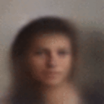

# Face Generator from Attributes using a Conditional Variational Autoencoder

This project comprises of two files:
- `Face_VAE.py` : For training the Conditional VAE 
- `Face_Generator.py` : To generate faces from a noise vector along with the vector of attributes

The model was trained on the a resized version ( 48 x 48 ) version of the [CelebA](http://mmlab.ie.cuhk.edu.hk/projects/CelebA.html) dataset. Initially it was trained on a reduced size of 30k images. In the end, it was trained on the entire train set of 160k images, albeit for a reduced training period.

The following attributes from the CelebA dataset were used for training. They were selected based on how easy it would be to identify such attributes on a face as well as the frequency of appearance in the dataset.
- Black_Hair
- Blond_Hair
- Brown_Hair
- Male
- No_Beard
- Smiling
- Straight_Hair
- Wavy_Hair
- Young

The attribute vector would have values of -1.0 and 1.0 indicating wheter the attribute was present or not. During the generation however continuous values from -1.0 to 1.0 can be given and a gradual increase in the strength of the property is observed. The best example of this is by varying the `Smiling` value. 

## Running this project

### For training
You will have to first download the [img_align_celeba.zip](https://drive.google.com/drive/folders/0B7EVK8r0v71pTUZsaXdaSnZBZzg) file into celebA folder. After that you can use the Jupyter notebook `Face_VAE.ipynb` to train and modify the hyperparamters as desired.

The saved models will be in the `models` sub folder. It also contains pre trained weights.

### For using the generator
`Face_Generator.ipynb` contains the code to load the model from disk and generate a face from given attributes. If you keep the Z vector same while changing the attributes you can see more clearly the effect of them on the current face.

## Some sample outputs

## Futhur Developments
- Deploying the model as a web app so that it is easier to use the generator
- Currently the resolution of the images seem to be too low. Keeping the current weights, I am considering creating a network for upsampling the images to a higher resolution
- Or retraining using a higher resolution. But the SuperResolution idea is what I'm starting with.